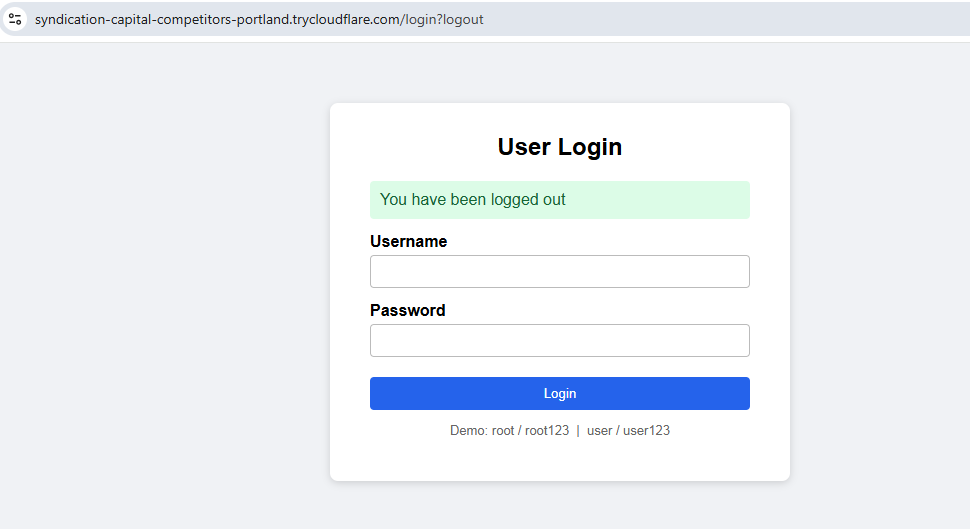
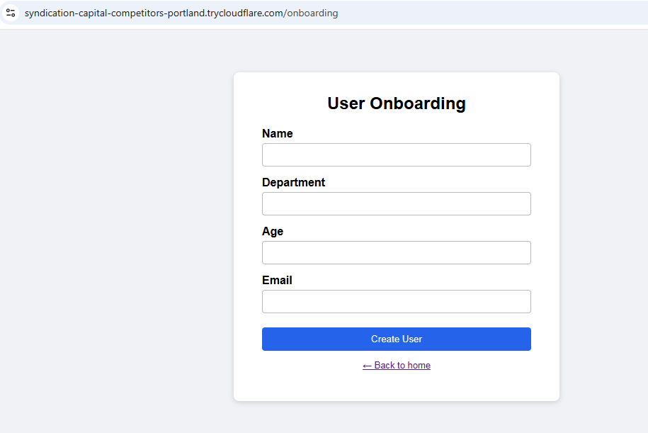
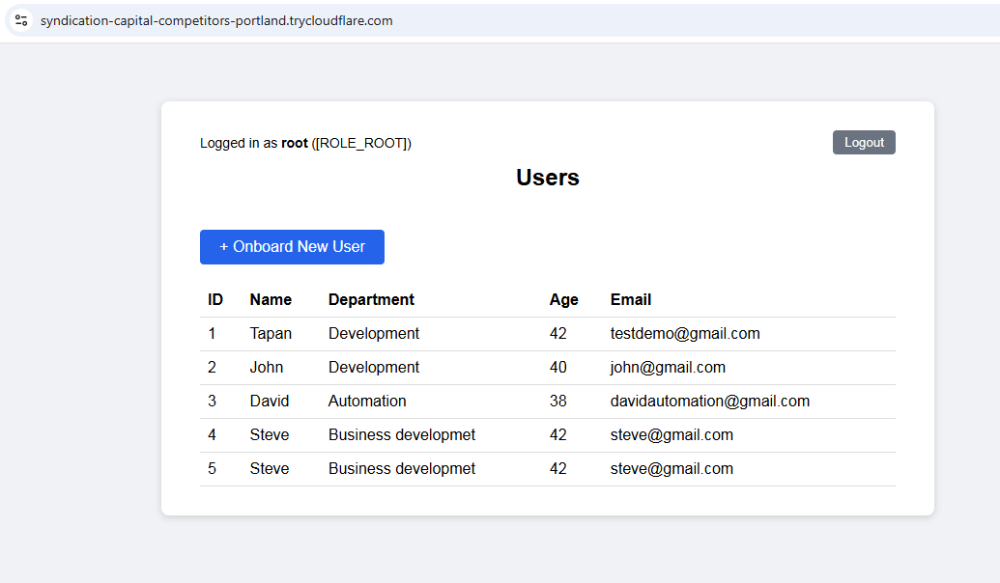
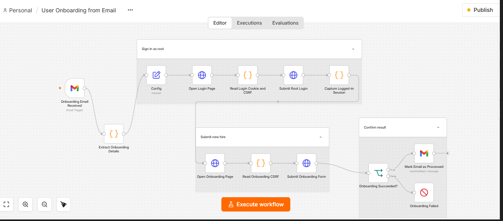
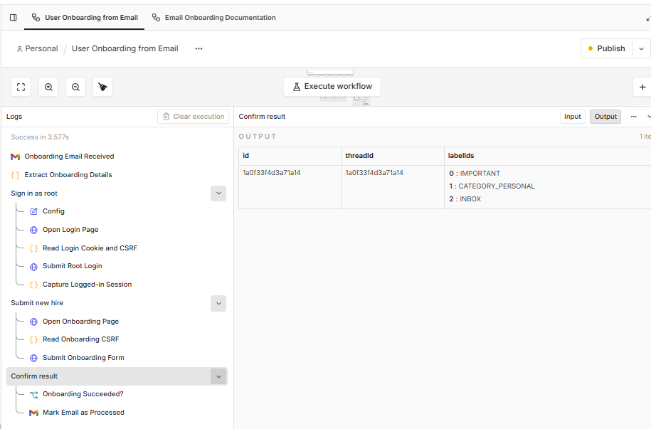
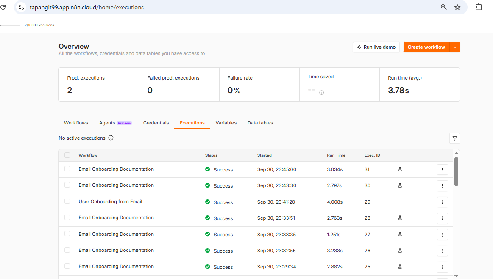

# User Onboarding Demo

A **Spring Boot + Thymeleaf** web application with role-based login (**ROOT** and **USER**) and a user onboarding form, together with a **separate n8n automation** that onboards users automatically from an email.


---

## Overview

This project has **two independent parts**:

| Part | What it is | Where it lives |
|---|---|---|
| **1. Web application** | Spring Boot + Thymeleaf app with login, a user list and an onboarding form | This repository |
| **2. Onboarding automation** | An **n8n** workflow that signs in as ROOT and submits the onboarding form for a new hire received by email | n8n Cloud (separate from this code) |

The automation is **not part of the Spring Boot code**. n8n simply behaves like a browser: it opens the login page, signs in as `root`, and fills in the same onboarding form a person would use.

```
                 (manual use)                        (automated use)

  Person  ---->  Login  ---->  Onboarding form  <----  n8n workflow  <----  Email (Gmail)
                                     |
                                     v
                          Users list (H2 database)
```

## Table of Contents

1. [Features](#features)
2. [Application Screens](#application-screens)
3. [Tech Stack](#tech-stack)
4. [Getting Started](#getting-started)
5. [Roles and Access](#roles-and-access)
6. [Endpoints](#endpoints)
7. [Project Structure](#project-structure)
8. [Running the Tests](#running-the-tests)
9. [Automated Onboarding with n8n](#automated-onboarding-with-n8n)
10. [Security Notes](#security-notes)

---

## Features

- Form-based **login** with Spring Security (session cookie and CSRF protection)
- Two roles: **ROOT** and **USER**
- **Onboarding** form (Name, Department, Age, Email) with server-side validation, ROOT only
- **Users** page listing everyone onboarded, visible to both roles
- Role-based redirect after login: ROOT goes to the onboarding form, USER goes to the users list
- In-memory **H2** database through Spring Data JPA
- Automated **MockMvc** tests for the security rules and the onboarding flow
- **Separate n8n automation** that onboards users from an email

## Application Screens

### 1. Login



### 2. User Onboarding form (ROOT only)

ROOT lands here right after login. Validation: all fields are required, age must be between 18 and 100, and the email must be valid.



### 3. Users list

Shown to both roles. Only ROOT sees the **+ Onboard New User** button.



## Tech Stack

| Layer | Technology |
|---|---|
| Language | Java 17 |
| Framework | Spring Boot 3.3.5 |
| Views | Thymeleaf + `thymeleaf-extras-springsecurity6` |
| Security | Spring Security (form login, BCrypt, CSRF) |
| Persistence | Spring Data JPA + H2 (in-memory) |
| Validation | Jakarta Bean Validation |
| Build | Maven |
| Tests | JUnit 5, MockMvc, Spring Security Test |
| Automation | n8n (Gmail trigger + HTTP Request nodes) |

## Getting Started

**Prerequisites:** JDK 17+ and Maven 3.8+.

```bash
mvn spring-boot:run
```

Open <http://localhost:8080> (the default port). You will be redirected to the login page.

### Demo accounts

| Username | Password | Role |
|---|---|---|
| `root` | `root123` | ROOT |
| `user` | `user123` | USER |

## Roles and Access

| Screen / Action | ROOT | USER | Anonymous |
|---|:---:|:---:|:---:|
| Login page | yes | yes | yes |
| Users list | yes | yes | redirected to login |
| Onboarding form (view and submit) | yes | 403 Forbidden | redirected to login |

After a successful login, **ROOT** is redirected to `/onboarding` and **USER** to `/`.

## Endpoints

This is a server-rendered app, so there is no JSON API. Every endpoint returns HTML or a redirect, and form posts use `application/x-www-form-urlencoded`.

| Method | Path | Access | Description |
|---|---|---|---|
| GET | `/login` | Public | Login page (contains a hidden `_csrf` field) |
| POST | `/login` | Public | Submit `username`, `password`, `_csrf` |
| POST | `/logout` | Logged in | End the session (`_csrf` required) |
| GET | `/` | Logged in | Users list |
| GET | `/onboarding` | ROOT | Onboarding form (contains a hidden `_csrf` field) |
| POST | `/onboarding` | ROOT | Submit `name`, `department`, `age`, `email`, `_csrf` |

**Responses worth knowing when automating:**

| Request | Result |
|---|---|
| `POST /login` success | `302`, new `JSESSIONID` cookie, `Location: /onboarding` (ROOT) or `/` (USER) |
| `POST /login` failure | `302` to `/login?error` |
| `POST /onboarding` success | `302` to `/` |
| `POST /onboarding` validation error | `200` with the form re-rendered and error messages |
| `POST /onboarding` as USER, or bad CSRF token | `403` |

## Project Structure

```
onboarding-demo/
├── pom.xml
├── README.md
├── docs/screenshots/                # images used in this README
└── src/
    ├── main/
    │   ├── java/com/example/demo/
    │   │   ├── DemoApplication.java
    │   │   ├── config/SecurityConfig.java        # roles, rules, login redirect
    │   │   ├── model/Employee.java               # entity + validation
    │   │   ├── repo/EmployeeRepository.java
    │   │   └── web/
    │   │       ├── LoginController.java          # /login and /
    │   │       └── OnboardingController.java     # /onboarding
    │   └── resources/
    │       ├── application.properties
    │       ├── static/css/style.css
    │       └── templates/                        # login, home, onboarding
    └── test/java/com/example/demo/
        └── SecurityAndOnboardingTest.java
```

## Running the Tests

```bash
mvn test
```

The tests cover: anonymous redirect to login, login success and failure, role-based redirect after login, USER getting 403 on `/onboarding`, ROOT creating a user, and validation errors saving nothing.

---

## Automated Onboarding with n8n

User onboarding is also **automated separately by n8n**, without touching the application code. When an onboarding email arrives, the n8n workflow **User Onboarding from Email** logs in as ROOT, submits the onboarding form and confirms the result.

### Workflow



```
Gmail Trigger -> Extract Onboarding Details -> Config
   -> [Sign in as root] -> [Submit new hire] -> [Confirm result]
```

| Group | Node | Type | What it does |
|---|---|---|---|
| (start) | Onboarding Email Received | Gmail Trigger | A new email starts the run |
| (start) | Extract Onboarding Details | Code | Pulls the new hire's details out of the email |
| (start) | Config | Set (manual) | Holds the app's base URL and the root credentials |
| **Sign in as root** | Open Login Page | HTTP Request | `GET /login` |
| | Read Login Cookie and CSRF | Code | Reads `JSESSIONID` and the `_csrf` token from the response |
| | Submit Root Login | HTTP Request | `POST /login` with `username`, `password`, `_csrf` |
| | Capture Logged-in Session | Code | Keeps the new `JSESSIONID` issued after login |
| **Submit new hire** | Open Onboarding Page | HTTP Request | `GET /onboarding` with the session cookie |
| | Read Onboarding CSRF | Code | Reads a fresh `_csrf` token for this session |
| | Submit Onboarding Form | HTTP Request | `POST /onboarding` with name, department, age, email, `_csrf` |
| **Confirm result** | Onboarding Succeeded? | IF | A `302` back to `/` means success |
| | Mark Email as Processed | Gmail (mark as read) | Runs on the **true** branch |
| | Onboarding Failed | Stop / error | Runs on the **false** branch |

### Execution

Each run shows every step in the execution log. In this run all steps succeeded, and the last Gmail node marked the email as processed.



The **Executions** page lists the runs of the workflow, with their status, start time and duration.



After a successful run, the new person appears in the **Users list** of the application (screen 3 above).

> **Tip:** the Gmail trigger only fires automatically once the workflow is **published** (the **Publish** button, top right). While it is unpublished, use **Execute workflow** to test.

### Why the workflow looks like this

The app uses a session cookie and CSRF tokens rather than a token API, so the workflow must:

1. Use HTTP Request nodes with **Follow Redirects off** and **Full Response on**, so `Location` and `Set-Cookie` can be read.
2. Pass the `JSESSIONID` cookie along manually, because n8n does not keep cookies between nodes.
3. Take the **new** `JSESSIONID` after login (Spring rotates the session on login) and fetch a **fresh** `_csrf` from `/onboarding` before submitting the form.

### Exposing the app to n8n Cloud

n8n Cloud cannot reach `localhost`, so publish the app with a Cloudflare quick tunnel:

```powershell
winget install --id Cloudflare.cloudflared
# open a NEW PowerShell window so PATH is refreshed, then:
cloudflared tunnel --url http://localhost:8080
```

The command prints a public URL such as `https://<random-words>.trycloudflare.com`. Put it in the workflow's **Config** node as the base URL.

Things to remember:

- The tunnel URL **changes every time** the tunnel restarts, so update the Config node each time.
- The app and the tunnel must both be running while the workflow executes.
- The tunnel port must match the port the app listens on (8080 by default, or `server.port` if you changed it).
- If redirects come back as `http://` instead of `https://`, add this line to `application.properties` and restart:

  ```properties
  server.forward-headers-strategy=framework
  ```

### Try the flow manually with curl

```bash
BASE=https://<your-tunnel>.trycloudflare.com

# 1. login page: get cookie + csrf
curl -s -c c.txt $BASE/login | grep _csrf

# 2. login
curl -i -b c.txt -c c.txt -X POST $BASE/login \
  -d "username=root&password=root123&_csrf=TOKEN1"

# 3. fresh csrf for the new session
curl -s -b c.txt -c c.txt $BASE/onboarding | grep _csrf

# 4. create a user
curl -i -b c.txt -c c.txt -X POST $BASE/onboarding \
  -d "name=Asha&department=IT&age=30&email=asha@example.com&_csrf=TOKEN2"
```

## Security Notes

This is a **demo**. Before using any of it for real:

- Replace the in-memory demo accounts (`InMemoryUserDetailsManager`) with a database-backed `UserDetailsService` and real passwords.
- Do not commit or share real credentials. Store n8n credentials in the n8n credential store, not in plain Set nodes.
- Quick tunnels are public and have no uptime guarantee. Use a named, access-controlled tunnel for anything beyond a demo.
- H2 is in-memory, so all onboarded users are lost when the app restarts. Switch to a persistent database for real data.
